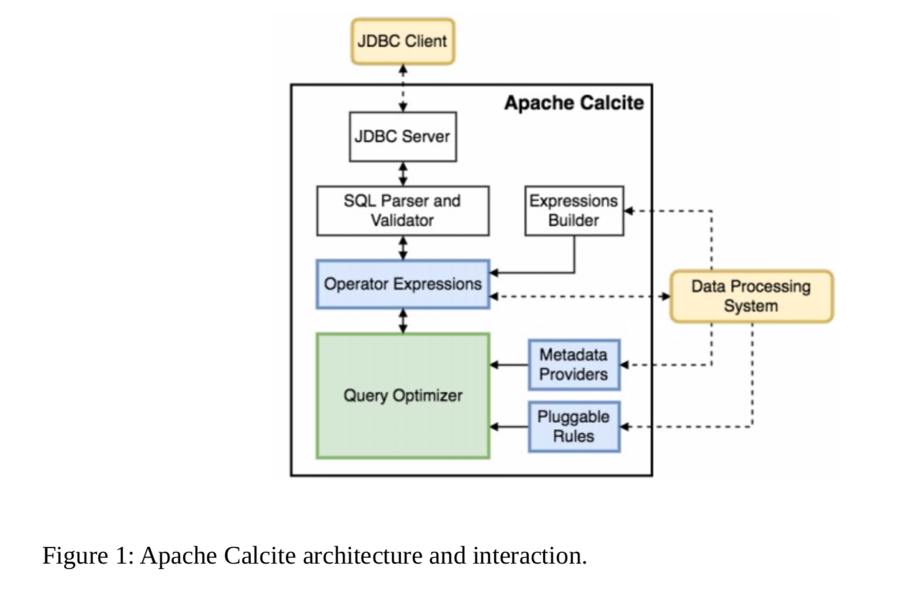

# 背景

Apache Calcite是一个基础软件框架,为许多流行的开源数据处理系统提供查询处理、优化和查询语言支持

架构体系包括

1.一个具有数百个内置优化规则的模块化可扩展查询优化器

2.一个能够处理多种查询语言的查询处理器

3.一个 为可扩展性设计的适配器体系结构

4.对异构数据模型和存储(关系、半结构化、流式和地理空间)的支持


# 架构



Calcite包含一个query Parser和Validator，可以将一个 SQL 查询转换成一个关系运算符树。由于Calcite不包含存储层，它提供了一种通过适配器在外部存储引擎中定义table schena和view的机制 

# QUERY ALGEBRA 

## Operators

Relational Algebra是Calcite的核心,除了表示最常见的数据处理操作的操作符，如filter、project、join 等。数据库，calcite包括满足不同目的的附加操作符，例如，能够简明地表示复杂的操作，或更有效地识别优化

例如，对于 OLAP、决策制定和流应用程序来说，使用窗口定义来表示复杂的分析函数已经变得很普遍， 例如一个数量在一个时间段或一个数字或行上的移动平均。Calcite引入了一个窗口操作符,它封装了窗口定义，即上限和下限,分区等以及要在每个窗口上执行的聚合函数  


## Trait

Calcite不使用不同的Entity来表示逻辑和physical Operator。它使用特征描述了与Operator相关的物
理属性。这些特征有助于优化者评估不同备选方案的成本。改变特性值不会改变被评估的逻辑表达式，
即由给定运算符产生的行仍然是相同的。

在优化过程中，Calcite试图在关系表达式上实施某些特征，例如某些列的排序顺序,相关运算符可以
实现转换器接口，该接口指示如何将表达式的特征从一个值转换为另一个值


```
这里需要 flink的例子
```

##  Adapters


Adapters是一种架构模式，
它定义了Calcite如何合并不同的数据源以供一般访问。下图描述了它的组件。
本质上，适配器由模型、模式和模式工厂组成。模型是正在访问的数据源的物理属性的规范。模式是模型中数据(格式和布局)的定义。
数据本身通过表进行物理访问。

# 查询处理和优化

query optimizer是框架中的主要组件。calcite通过对关系表达式重复应用planner rules来优化查询。
一个cost model指导着这个过程，planner engine试图生成一个替代表达式，它与原始表达式具有相同的语义，但是成本较
低。优化器中的每个组件都是可扩展的。用户可以添加关系运算符、规则、成本模型和统计数据。

## planner Rules
Calcite包含一组规划规则来转换表达式树。具体来说，规则匹配树中的给定模式，并执行保留该表
达式语义的转换。Calcite包含数百个优化规则。然而，依赖方Calcite进行优化的数据处理系统通常会包含
自己的规则，以允许特定的重写

```
这里需要举例flink的例子
```

例如，Calcite为 Apache Cassandra提供了一个适配器，这是一个宽列存储，它按表中列的子集对数 据进行分区，然后在每个分区内，根据列的另一个子集对行进行排序。为了提高效率，适配器将尽可能多的查询处理下推到每个后端是有益的。数据库将排序推入Cassandra的规则必须检查两个条件: 

(1)该表先前已经被过滤到单个分区(因为行只在一个分区内排序)和(2)在 Cassandra 中分区的排序具有一 些带有所需排序的公共前缀。

这需要将一个LogicalFilter重写为一个CassandraFilter，以确保分区过滤器被下推到数据库。规则的效果 很简单(将一个LogicalSort转换成一个CassandraSort排序)，但是规则匹配的灵活性使得后端即使在复杂的场景中也能按下操作符。

Calcite通过 FilterIntoJoinRule 实现这种优化，该规则将一个过滤器节点与一个 作为父节点的连接节点进行匹配，并检查该连接是否可以执行过滤器。这种优化说明了Calcite优化方法 的灵活性。


## MetaData Provider

MetaData是Calcite优化器的重要组成部分，它有两个主要目的:

(1)引导planner实现降低整体 查询计划成本的目标，

(2)在应用规则时向规则提供信息


Calcite提供者负责向优化器提供该信息。具体来说，Calcite中的默认元数据提供程序实现包含返回在运
算符树中执行子表达式的总成本、该表达式结果的行数和数据大小以及可执行的最大并行度的函数。数据库反
过来，它还可以提供关于计划结构的信息，例如，特定树节点下存在的过滤条件。

Calcite提供了允许数据处理系统将元数据信息插入框架的接口。这些系统可以选择编写覆盖现有函数的
提供程序，或者提供它们自己的新的元数据函数，这些函数可能在优化阶段使用。然而，对于它们中的
许多，提供关于它们的输入数据的统计就足够了，例如，行数和表的大小，给定列的值是否唯一等。
方解石将通过使用其默认实现来完成剩余的工作

```
这里加个 flink的例子
```

## Planner Engines

Planner Engines的主要目标是触发提供给引擎的规则，直到它达到给定的目标。目前，Calcite提供
了两种不同的引擎。新的引擎可以在框架中插入
```
flink举个例子
```

### CBO

a cost-based planner engine 

它触发输入规则，目标是降低总体表达式成本。该引擎使用一个动态编 程算法，类似于火山，创建和跟踪 不同 alternative plans

最初，每个表达式都在规划器中注册，并带有基于表达式属性及其输入的摘要。数据库当在 表达式 e1 上触发一个规则并且该规则产生一个新的表达式 e2 时，规划者将把 e2 添加到 e1 所属的等价 表达式 s a 的集合中。数据库此外，计划员为新表达式生成一个摘要，该摘要将与之前在计划员中注册的摘要进 行比较。数据库如果找到了与属于集合 Sb 的表达式 e3 相关联的相似摘要，则规划者已经找到了副本，因此将 Sa 和 Sb 合并到新的等价集合中。数据库该过程一直持续到规划器到达可配置的固定点。数据库具体来说，它可以(I) 彻底探索搜索空间，直到所有规则都应用于所有表达式，或者(ii)当计划成本在最后一次计划迭代中没有 提高超过给定阈值 δ 时，使用基于启发式的方法来停止搜索。数据库允许优化器决定选择哪个计划的成本函数 是通过元数据提供者提供的。
默认的成本函数实现结合了对给定表达式使用的中央处理器、输入输出和 内存资源的估计。

```
flink 举个例子
```

### RBO

一个详尽的计划器，它详尽地触发规则，直到它生成一个不再被任何规则修改的表达式。数据库
这种规划器在不考虑每个表达式的成本的情况下快速执行规则非常有用

```
flink 举个例子
```

## 物化视图

用于OLAP系统中，当然部分OLTP系统的小部分功能未了提高性能会借鉴一点点，因为表关联的开销很大，所以在开发中很多人就 像把这个代价交给定期转存来完成，ORACLE当然也提供了这个功能，就是将视图（或者一个大SQL）的信息转换为物理数据存储，然后提供 不同的策略：定时刷还是及时刷、增量刷还是全局刷等等可以根据实际情况进行选择，总之你查的是表，不是视图


```
Calcite 这块是啥 要看一下
```
#Calcite Api


