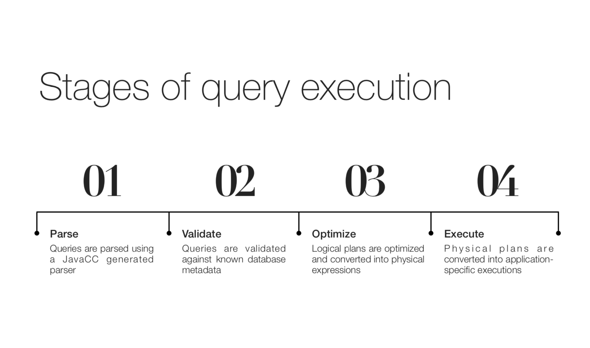
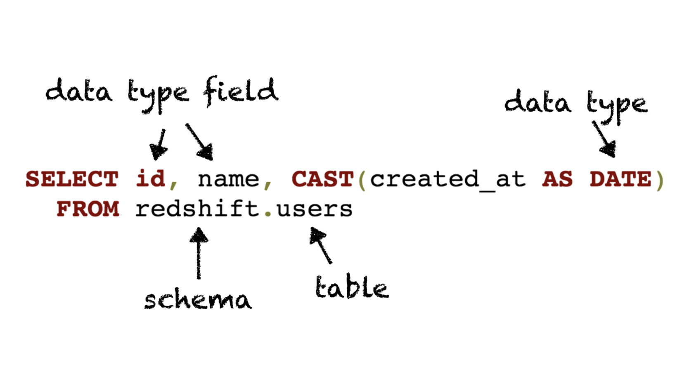

# COMPONENTS 

## **Catalog** 

Defines metadata and namespaces that can be accessed in SQL queries 

###Schema

###TABLE

###RelDataType

###Statistic

## **SQL parser** 

Parses valid SQL queries into an abstract syntax tree (AST) 

LL(k) parser written in JavaCC
Input queries are parsed into an abstract syntax tree (AST)
Tokens are represented in Calcite by SqlNode
SqlNode can also be converted back to a SQL string via the unparse method

##JavaCC
Java Compiler Compiler
Created in 1996 at Sun Microsystems
Generates Java code from a domain- specific language
ANTLR is the modern alternative used in projects like Hive and Drill
JavaCC has sparse documentation

##SQLNode
SqlNode represents an element in an abstract syntax tree

## **SQL validator** 

Validates abstract syntax trees against metadata provided by the catalog 

## **Query optimizer** 

 Converts AST into logical plans, optimizes logical plans, and converts logical expressions into physical plans

###Query Plan
Query plans represent the steps necessary to execute a query

###Query Optimization

Optimize logical plan
Goal is typically to try to reduce the amount of data that must be processed early in the plan
Convert logical plan into a physical plan
Physical plan is engine specific and represents the physical execution stages

Prune unused fields
Merge projections
Convert subqueries to joins Reorder joins
Push down projections Push down filters

## **SQL generator** 

 Converts physical plans to SQL 

## 关键词 

###Relational algebra (RelNode)

RelNode represents a relational expression 
Largely equivalent to Spark’s DataFrame methods
Logical algebra 
Physical algebra

TableScan (FlinkTableScan)
Project (FlinkProject)
Filter (FlinkFilter)
Aggregate (FlinkAggregate)
Join (FlinkJoin)
Union (FlinkUnion)
Intersect (FlinkIntersect)
Sort (FlinkSort)

 

###Row expressions (RexNode)

RexNode represents a row-level expression
Largely equivalent to Spark’s Column
Projection fields 
Filter condition 
Join condition 
Sort fields

Input column ref  (RexInputRef)
Literal (RexLiteral)
Struct field access (RexFieldAccess)
Function call (RexCall)
Window expression (RexOver)

###Traits  (RelTrait)

Defined by the RelTrait interface 
Represent a trait of a relational expression
that does not alter execution
Traits are used to validate plan output 
Three primary trait types:
Convention
RelCollation
RelDistribution

###Conventions (Convention)

Convention is a type of RelTrait

A Convention is associated with a
RelNode interface

SparkConvention, JdbcConvention,
EnumerableConvention, etc

Conventions are used to represent a single data source

Inputs to a relational expression must be in the same convention

###Rules (RelOptRule)

Rules are used to modify query plans 
Defined by the RelOptRule interface
Two types of rules: converters and transformers
Rules

Converter rules implement Converter and convert from one convention to another

Rules are matched to elements of a query plan using pattern matching

onMatch is called for matched rules 

Converter rules applied via convert

####Converter Rule

####Pattern Match

###Planners (RelOptPlanner)

Planners implement the RelOptPlanner interface

Two types of planners:
HepPlanner
VolcanoPlanner

####Heuristic Optimization

HepPlanner is a heuristic optimizer similar to Spark’s optimizer
Applies all matching rules until none can be applied
Heuristic optimization is faster than cost- based optimization
Risk of infinite recursion if rules make opposing changes to the plan

####Cost-based Optimization
VolcanoPlanner is a cost-based optimizer
Applies matching rules iteratively, selecting the plan with the cheapest cost on each iteration
Costs are provided by relational expressions 
Not all possible plans can be computed
Stops optimization when the cost does not significantly improve through a determinable number of iterations   

Cost is provided by each RelNode 
Cost is represented by RelOptCost
Cost typically includes row count, I/O, and CPU cost
Cost estimates are relative
Statistics are used to improve accuracy of cost estimations
Calcite provides utilities for computing various resource-related statistics for use in cost estimations

###Programs (Program)

